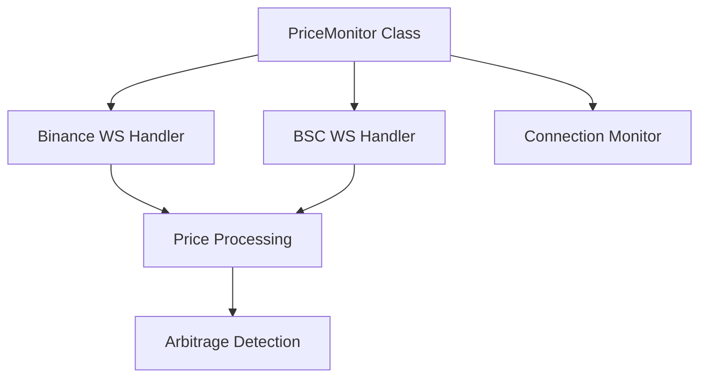
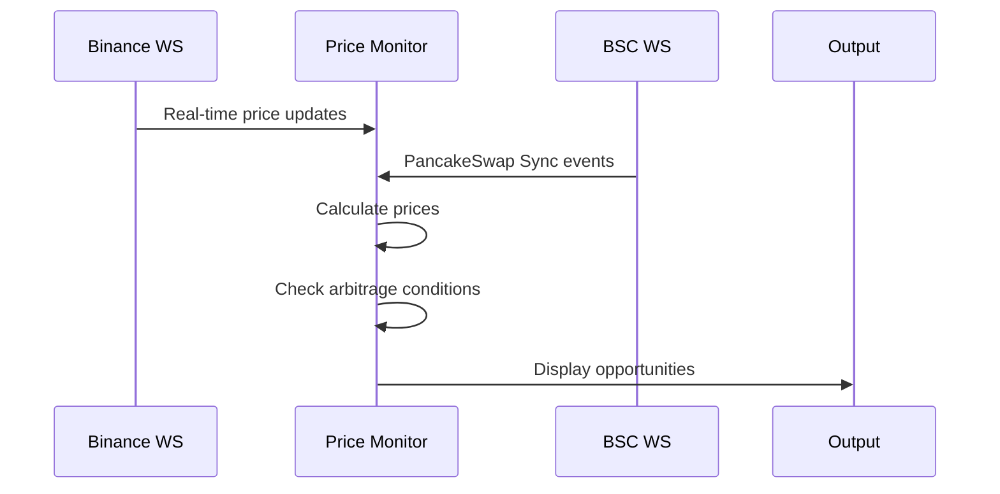

# Binance-PancakeSwap Arbitrage Monitor

Real-time price monitoring system for detecting arbitrage opportunities between Binance and PancakeSwap for BNB/USDT pair.

This tool monitors price differences between centralized (Binance) and decentralized (PancakeSwap) exchanges to identify potential arbitrage opportunities. It uses WebSocket connections to both platforms for real-time updates and alerts when the price difference exceeds a configurable threshold.

## System Architecture
1. **Price Data Sources**
    - **Binance WebSocket** (`wss://stream.binance.com:9443`)
        - Provides real-time BNB/USDT price updates
        - Uses the `bnbusdt@ticker` stream
        - Implements automatic reconnection and health monitoring

    - **BSC WebSocket** (`wss://bsc.publicnode.com`)
        - Connects to BSC network for PancakeSwap data
        - Monitors Sync events from the PancakeSwap pair contract
        - Calculates real-time prices from reserve updates

2. **Threading Model**
```
Main Thread
   ├── Binance WebSocket Thread
   ├── BSC WebSocket Thread
   └── Connection Monitor Thread
```
- All threads are daemon threads (terminate when main thread ends)
- Uses thread synchronization with locks for price updates

3. **Core Components**


4. **Error Handling & Reliability**
- Automatic WebSocket reconnection
- Connection health monitoring (30s timeout)
- Thread-safe price updates
- Exception handling for network issues
- SSL certificate verification bypass for testing

## Key Features
1. **Price Monitoring**
    - Real-time price updates from both sources
    - Thread-safe price storage
    - Price calculation from PancakeSwap reserves

2. **Arbitrage Detection**
```
  # Pseudocode of logic
   if |binance_price - pancake_price| / pancake_price * 100 >= threshold:
       detect_arbitrage_opportunity()
```
3. **WebSocket Management**
    - Ping/Pong heartbeat (20s interval)
    - Automatic reconnection
    - Connection health monitoring
    - Event-based message processing

4. **Smart Contract Integration**
    - Interacts with PancakeSwap pair contract
    - Monitors Sync events for reserve updates
    - Calculates prices from reserve ratios

## Data Flow


## System Features

1. **Configuration Parameters**
   - WebSocket ping interval: 20 seconds
   - Connection timeout: 30 seconds
   - Reconnection delay: 5 seconds
   - Price calculation using 18 decimals (standard for ERC20)

2. **Smart Contract Details**
   - WBNB Address: `0xbb4CdB9CBd36B01bD1cBaEBF2De08d9173bc095c`
   - USDT Address: `0x55d398326f99059fF775485246999027B3197955`
   - PancakeSwap Pair: `0x16b9a82891338f9bA80E2D6970FddA79D1eb0daE`

3. **Monitoring and Logging**
   - Detailed logging for different components
   - Price update notifications
   - Error reporting
   - Connection status updates
   - Arbitrage opportunity alerts

4. **Safety Features**
   - Thread synchronization
   - Dead connection detection
   - Error handling for network issues
   - Safe shutdown handling

## Latency Optimization Strategies

1. **Orderbook Depth Analysis**
   - Subscribe to Binance depth updates via WebSocket (`bnbusdt@depth`) to monitor the full orderbook
   - Calculate potential price impact of large pending orders before they're executed
   - Identify thin orderbook areas where price movements are likely to occur
   - Detect orderbook imbalances that precede price movements
   - Predict price movements by monitoring bid-ask spread changes and order concentration

2. **Mempool Monitoring**
   - Implement direct mempool monitoring to detect pending transactions that will affect PancakeSwap reserves
   - Detect large swaps before they're confirmed on-chain
   - Calculate potential price impact before the transaction is mined

3. **WebSocket Connection Optimization**
   - Implement connection pooling for multiple WebSocket connections to different nodes
   - Use premium BSC nodes with lower latency and higher reliability
   - Maintain backup connections to minimize reconnection delays

3. **Price Update Processing**
   - Implement priority queuing for price updates to process significant changes immediately
   - Use direct TCP connections instead of WebSocket where possible for lower latency
   - Optimize thread synchronization with fine-grained locks

4. **Event-Driven Architecture Enhancements**
   - Switch from polling to pure event-driven model with callbacks
   - Implement immediate price recalculation on ANY reserve change, not just after complete message processing
   - Use memory-mapped files for inter-thread communication

5. **Network Infrastructure**
   - Deploy the application on cloud instances in proximity to exchange datacenters
   - Use dedicated network connections with low latency to key exchanges
   - Implement network-level optimizations (TCP tuning, jumbo frames)

## Advanced Orderbook Analysis

Monitoring orderbooks provides critical advantages for arbitrage detection:

1. **Predictive Price Insights**
   - Large limit orders entering the book signal potential price barriers
   - Sudden orderbook thinning indicates potential for rapid price movements
   - Order imbalances between buy/sell sides predict directional moves

2. **Implementation Strategy**
   - Subscribe to Binance WebSocket depth stream: `wss://stream.binance.com:9443/ws/bnbusdt@depth`
   - Maintain local copy of order book with bid/ask levels
   - Calculate cumulative liquidity at different price points
   - Monitor key metrics:
     - Bid-ask spread widening/narrowing
     - Order book imbalance ratio
     - Liquidity walls (large orders at specific prices)
     - Sudden changes in order flow

3. **Comparison with DEX Liquidity**
   - Calculate equivalent "orderbook" from PancakeSwap's x*y=k formula
   - Identify price points with maximum divergence between CEX and DEX
   - Predict optimal trade sizes based on slippage curves

4. **Real-World Example**
   ```
   [Binance Orderbook]
   Asks: 795.20 (2.3 BNB), 795.50 (5.1 BNB), 796.00 (12.7 BNB)
   Bids: 794.80 (1.5 BNB), 794.50 (3.2 BNB), 794.00 (8.9 BNB)
   [PancakeSwap]
   Current Price: 794.91
   Slippage for 10 BNB sell: 0.42%

   Analysis: Large ask wall on Binance at 796.00 creates resistance
   Strategy: If PancakeSwap price rises above 795.20 while Binance 
   remains constrained, arbitrage opportunity likely
   ```

## Potential Improvements
1. Add configuration file for easy parameter adjustment
2. Implement more sophisticated arbitrage detection
3. Add database logging for price history
4. Implement trading execution logic
5. Add more trading pairs
6. Include transaction cost calculations
7. Add API rate limiting protection
8. Implement proper logging framework

## Requirements

- Python 3.8+
- Web3.py
- Websocket-client
- json
- threading
- time
- ssl

## Setup

1. Install dependencies:
```bash
pip install -r requirements.txt
```

2. Configure environment variables (optional):
```bash
# You can customize these if needed
export BSC_WS_URL=wss://bsc.publicnode.com
```

3. Run the monitor:
```bash
python main.py
```

## Usage Example

When running the application, you'll see output similar to this:

```
[Main] Starting price monitor...
[Main] BSC WebSocket thread started
[Main] Binance WebSocket thread started
[Main] Monitor thread started
[Binance WS] Connection established
[BSC WS] Connection established
[BSC WS] Initial subscription sent
[BSC WS] PancakeSwap subscription sent
[Binance WS] New price: 795.0
[BNB] Binance: 795.000 | PancakeSwap: 793.836 | Diff: 0.15%
[BSC WS] PancakeSwap Sync event received
[PancakeSwap WS] New price: 793.836079668341
```

When an arbitrage opportunity is detected (difference > threshold):

```
[OPPORTUNITY] Buy on PancakeSwap, Sell on Binance | Binance: 800.00 | PancakeSwap: 793.80 | Diff: 0.78%
```


## Concluding Thoughts

1. **Node Selection**: While we use a public BSC node for WebSocket connections, a dedicated/premium node would provide better reliability for production use.

2. **Transaction Costs**: This implementation ignores transaction costs, but in real arbitrage scenarios, gas fees, spread, and slippage are critical factors that can eliminate profit margins.

3. **Trading Strategies**: Beyond simple price differences, more sophisticated strategies could include:
   - **Orderbook-Based Arbitrage**: Using order depth analysis to predict price movements before they occur
   - **Asymmetric Orderbook Strategies**: Detecting imbalances between Binance orderbook and PancakeSwap liquidity
   - **Multi-pair arbitrage routes** (triangular arbitrage)
   - **Flash loan-powered arbitrage**
   - **Cross-DEX arbitrage** (PancakeSwap vs. other BSC DEXes)
   - **MEV (Maximal Extractable Value)** strategies
   - **Liquidity Pool Rebalancing**: Exploiting anticipated rebalancing of AMM pools

4. **Risk Management**: Implement proper risk controls and position sizing for any automated trading.